# Anti Habits


## ■　サービス概要
Anti Habitsは悪習慣を取り除く手助けをするサービスです。
悪習慣を共有し、一定間隔で悪習慣をしていないか管理して目標達成を手助けします。
悪習慣を共有することで切磋琢磨できたり、自分以外のユーザに監視されてる錯覚を感じることで目標達成率を高められます。

悪習慣の例
- 休日の前日につい夜更かししてしまう
- お風呂にスマホを持ち込んでしまう
- ダイエットしたいのに大盛りを頼んでしまう

### サービスURL
https://anti-habits.com/

### ゲストユーザー
- メールアドレス：guest@example.com
- パスワード：password

## ■ 開発背景
自分自身、辞めたいと思っていてもついついやってしまっている習慣・悪い癖が多々ありました。
そのうちの1つに「お風呂にスマホを持ち込んで入浴中にYouTubeを見る」ことがあり、これを辞めたいとずっと思っていました。
妻の協力のもと監視してもらうことでスマホを持ち込むことがなくなり、今では入浴時間が自分を見つめ直したり深く思考する良い時間になっています。
このような悪習慣から効率良く脱却する手助けをしたいと思い、本アプリを考案しました。

## ■ ユーザー層について
- 勉強やバイト、部活動に忙しい学生
  - 少ない学生期間の中で悪習慣を取り除いて、自分がやりたいことにしっかり打ち込むために
- 学生を卒業し社会人になって間もない人
  - 学生時代よりできること・目標・責任も増えるので、より自己管理が大切になるので
- 目標・やりたいことはあるけど時間がないと思っている人
  - 今やっていることの中から惰性で行っている悪習慣を取り除けば少しは時間ができるかも？

## ■　サービスの利用イメージ
悪習慣を登録します。
一定期間毎にLINEに通知が来るので、 悪習慣を行ったかどうかアプリ上で入力を行います。
悪習慣とそれを行ったかどうかを共有することで、他のユーザーから擬似的に監視されている感覚になり、 悪習慣を取り除く手助けをしてくれます。
悪習慣を取り除くことで、自分がしたいことにより時間を使えるようになります。

## ■ 機能紹介

<table>
  <tr>
    <th>悪習慣一覧</th>
  </tr>
  <tr>
    <td>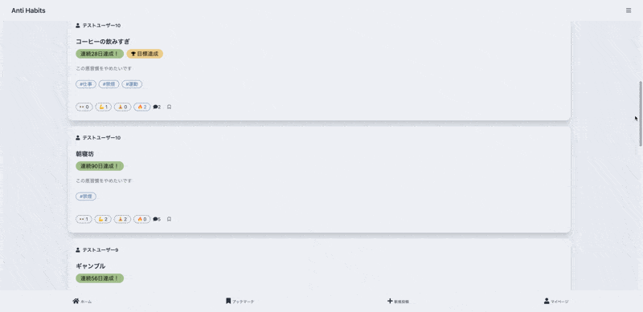</td>
  </tr>
  <tr>
    <td>ユーザーの投稿をまとめて確認できます。</td>
  </tr>
</table>

<table>
  <tr>
    <th>ランキング</th>
  </tr>
  <tr>
    <td>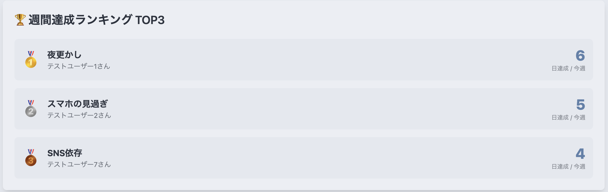</td>
  </tr>
  <tr>
    <td>ユーザーの投稿の中で今週に悪習慣を行わなかった日数のランキングを表示します。</td>
  </tr>
</table>

<table>
  <tr>
    <th>悪習慣登録</th>
  </tr>
  <tr>
    <td>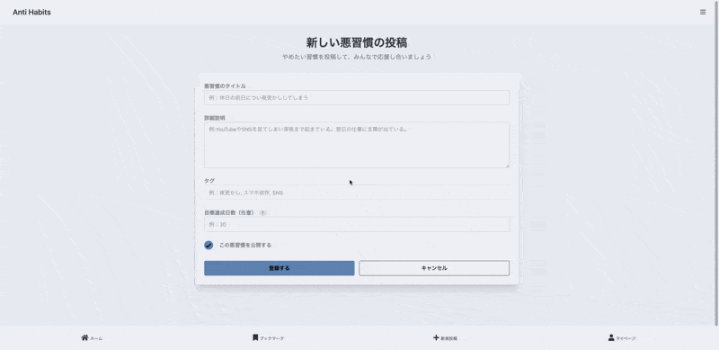</td>
  </tr>
  <tr>
    <td>取り除きたい悪習慣を登録します。何日連続で行わないことを目標にするか設定し、目標達成を目指しましょう。</td>
  </tr>
</table>

<table>
  <tr>
    <th colspan="2">Xシェア</th>
  </tr>
  <tr>
    <td>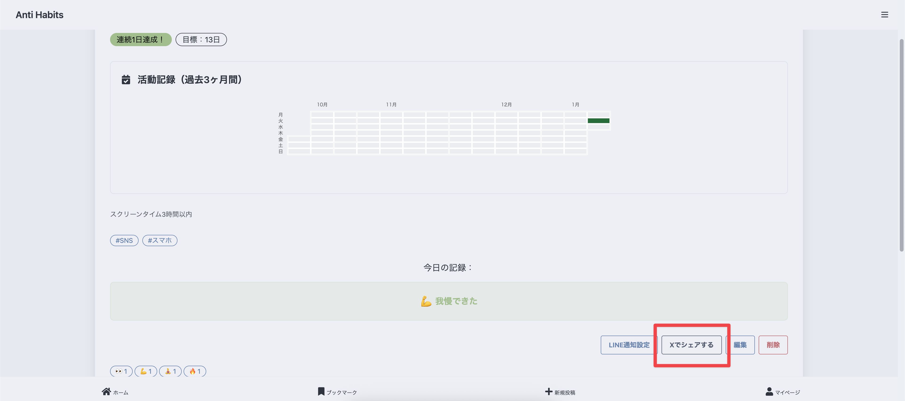</td>
    <td>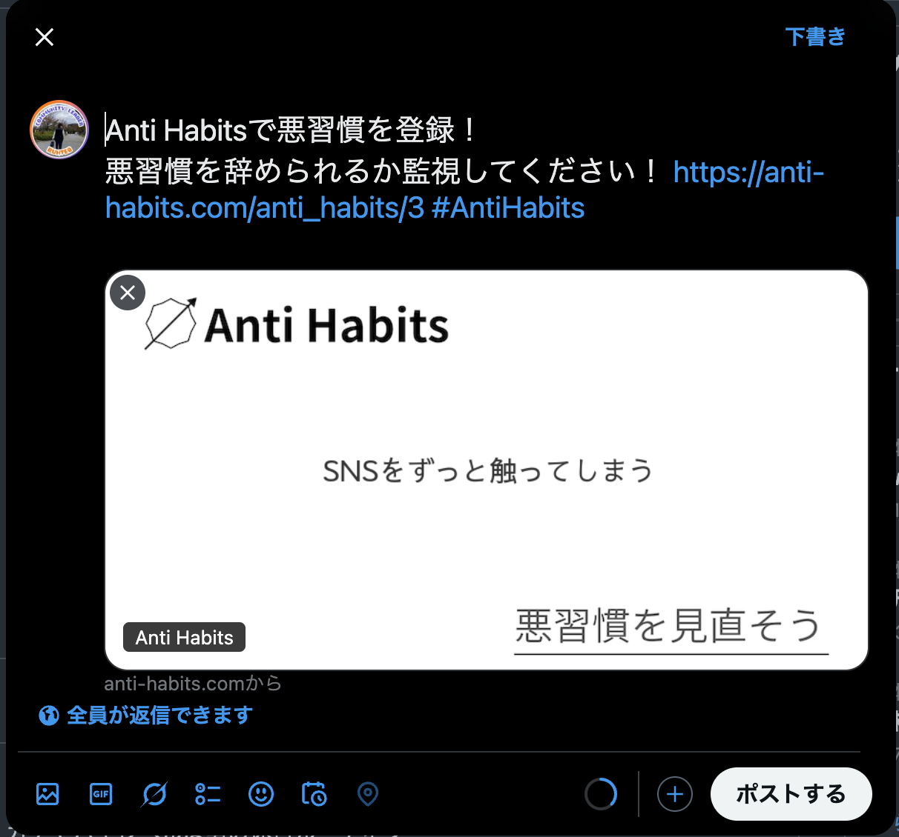</td>
  </tr>
  <tr>
    <td colspan="2">Xシェアを通して悪習慣を取り除く宣言ができます</td>
  </tr>
</table>

<table>
  <tr>
    <th colspan="2">LINE通知</th>
  </tr>
  <tr>
    <td>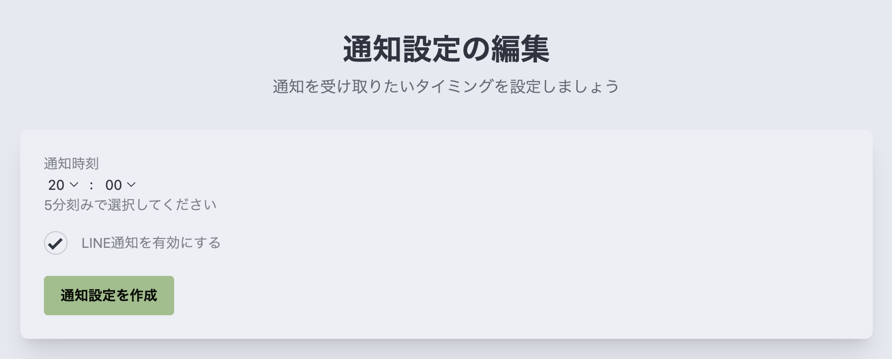</td>
    <td>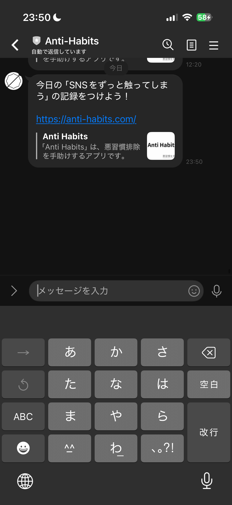</td>
  </tr>
  <tr>
    <td colspan="2">特定の悪習慣に対してLINEに通知することができます。<br>悪習慣が行われそうな時刻の少し前に設定しておくことでリマインド効果も期待できます。</td>
  </tr>
</table>

<table>
  <tr>
    <th>毎日の習慣記録</th>
  </tr>
  <tr>
    <td>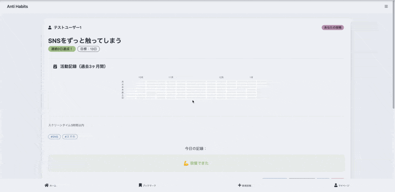</td>
  </tr>
  <tr>
    <td>投稿した悪習慣に対して、1日1回行わなかったかどうかの記録を行えます。<br>毎日続けることで連続達成日数がカウントされていきます。</td>
  </tr>
</table>

<table>
  <tr>
    <th>ヒートマップ</th>
  </tr>
  <tr>
    <td>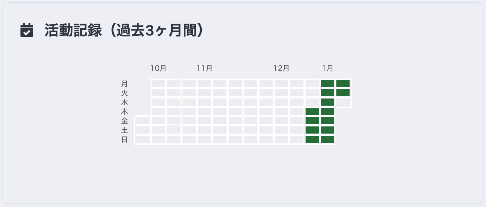</td>
  </tr>
  <tr>
    <td>悪習慣を行わなかった日を視覚的に確認できます。<br>連続記録を途切れさせたくないという抵抗感を味方に目標達成の手助けをしてくれます。</td>
  </tr>
</table>

<table>
  <tr>
    <th>目標達成</th>
  </tr>
  <tr>
    <td>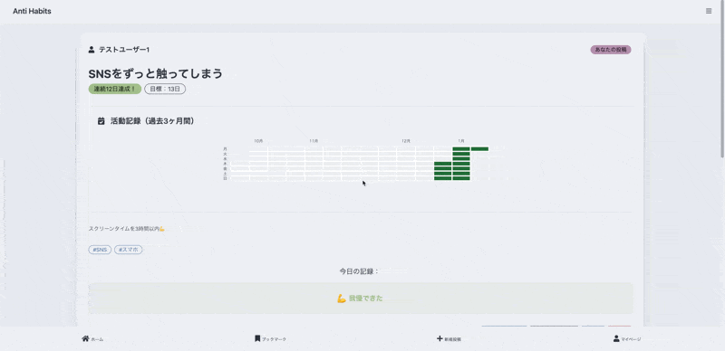</td>
  </tr>
  <tr>
    <td>目標を達成すると、投稿に対してバッジが付与されます。<br>1つの通過点として達成感を味わえます。</td>
  </tr>
</table>

<table>
  <tr>
    <th>リアクション</th>
  </tr>
  <tr>
    <td>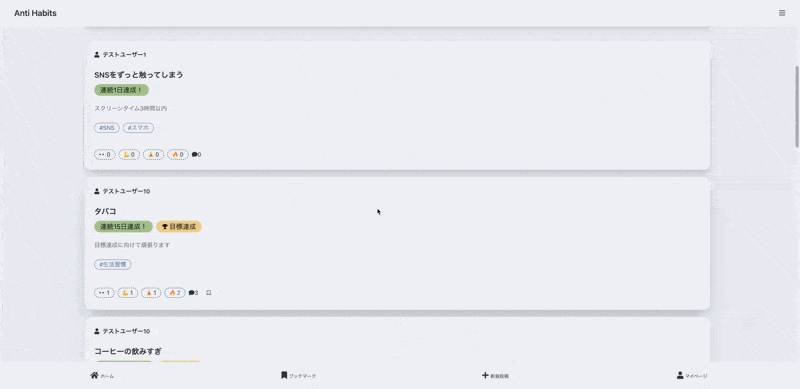</td>
  </tr>
  <tr>
    <td>悪習慣に対してリアクションを送ることで、ユーザー同士で見守り合えます。<br>適度な緊張感と応援が、目標達成の手助けとなります。</td>
  </tr>
</table>

<table>
  <tr>
    <th>コメント</th>
  </tr>
  <tr>
    <td>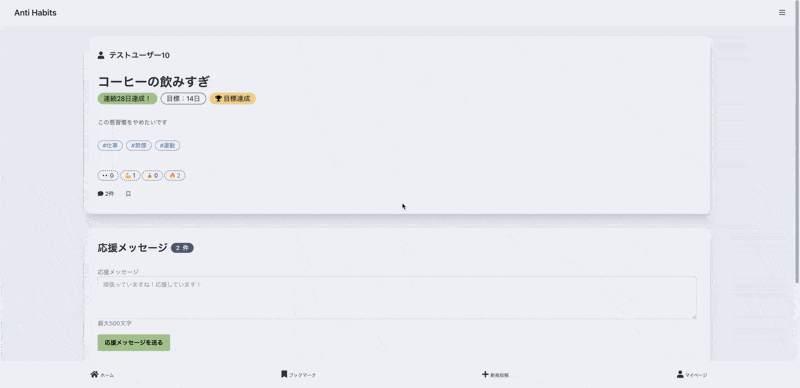</td>
  </tr>
  <tr>
    <td>悪習慣に対してコメントを行い、ユーザーとコミュニケーションをとることができます。</td>
  </tr>
</table>

<table>
  <tr>
    <th>ブックマーク</th>
  </tr>
  <tr>
    <td>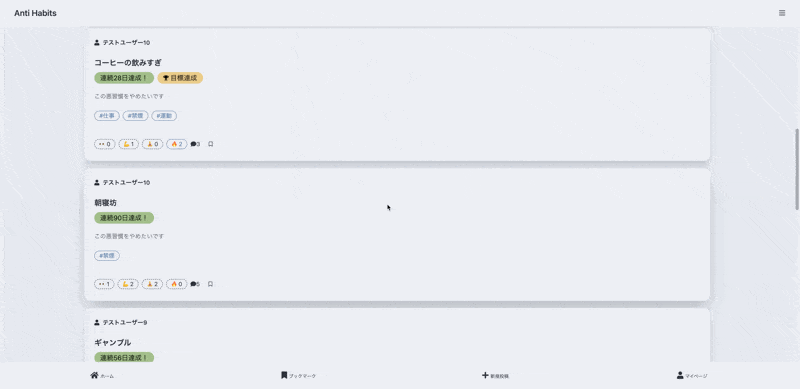</td>
  </tr>
  <tr>
    <td>同じ悪習慣を取り除こうとしている投稿や、特に監視したい投稿に関してブックマークをすることができます。</td>
  </tr>
</table>

## ■ サービスの差別化ポイント・推しポイント
複数の類似サービスを使用してみたのですが、個人利用のみのアプリとなっており、他のユーザーに悪習慣をシェアする機能はありませんでした。
Anti Habitsは他のユーザーから擬似的に監視されている感覚を味わえることが他のサービスとの差別化ポイントとなります。

## 技術構成
| カテゴリ | 使用技術 | 
| --- | --- | 
| フロントエンド | Tailwind CSS / DaisyUI / Hotwire (Turbo・Stimulus) / Vite | 
| バックエンド | PHP 8.3 / Laravel 13 | 
| インフラ | Render / Cloudinary(動的OGP画像生成) | 
| データベース | PostgreSQL |
| 環境構築 | Docker | 
| CI/CD | GitHub Actions | 

> Rails 7.2 版から Laravel 版へ移行しました。DB スキーマは Rails 版と完全に同一のため、既存のデータベースをそのまま利用できます（詳細は「Rails 版からの移行について」を参照）。

### 主要なパッケージ/外部サービスと用途
#### 認証・セキュリティ
* Laravel 標準の認証機能 - メール/パスワード認証、パスワードリセット（Devise と同じ users テーブル・パスワードハッシュを利用）
* Laravel Socialite (SocialiteProviders/Line) - LINEによる外部認証

#### データ検索・表示
* Eloquent のクエリビルダ - 悪習慣一覧の検索・絞り込み機能（Rails 版の Ransack と同じ検索パラメータ）
* Laravel 標準のページネーション

#### UI/UXデザイン
* Tailwind CSS / DaisyUI - UIデザイン・スタイリング
* Hotwire (Turbo / Stimulus) - 非同期通信の簡易化とインタラクティブな機能

#### フロントエンドツール
* Vite - JavaScript/CSS バンドラー
* Stimulus Autocomplete - 悪習慣一覧検索部分のオートコンプリート機能
* Tagify - タグのオートコンプリート機能, 直感的なタグ入力補助

#### データ可視化
* ECharts - 悪習慣詳細ページのカレンダーチャート表示

#### 非同期処理
* Laravel Scheduler / Queue - LINE通知の定期実行（5分ごと）

#### 外部サービス連携
* Cloudinary - 動的OGP画像生成
* LINE Messagin API- LINE通知
* XServer - 独自ドメイン

### その他
* Laravel Pint - コードフォーマッタ
* PHPUnit - テスト

## 開発環境の構築

### Docker を使う場合
```bash
docker compose up
# http://localhost:8000
```
初回起動時に `.env` の作成・マイグレーションまで自動で行います。開発用データは `docker compose exec web php artisan db:seed` で投入できます。

### ローカルの PHP / Node.js を使う場合
PostgreSQL が必要です。手元に無い場合は DB だけ Docker で起動してください（`127.0.0.1:5432` で接続できます）。
```bash
docker compose up -d db
```

```bash
composer install
npm install
cp .env.example .env   # DB 接続情報を環境に合わせて変更
php artisan key:generate
php artisan migrate --seed
composer run dev       # もしくは php artisan serve と npm run dev を個別に起動
php artisan schedule:work   # LINE 通知の定期実行を試す場合
```

### テスト・Lint
```bash
php artisan test        # PostgreSQL の anti_habits_test データベースを使用
vendor/bin/pint --test
```

## Rails 版からの移行について
* **DB スキーマは Rails 版と同一**です（テーブル・カラム型・デフォルト値・インデックス名・外部キー名まで一致）。マイグレーションは既存テーブルがあれば何もしないため、本番 DB に対して `php artisan migrate` を実行しても既存データは変更されず、Laravel の管理用 `migrations` テーブルが追加されるだけです。
* セッション・キャッシュ・キューに DB テーブルを使わない設定（cookie / file / sync）にしているため、既存スキーマにテーブルを追加しません。
* Devise で登録したユーザーは**同じパスワードでそのままログイン**できます（bcrypt 互換）。
* 日時は Rails 版と同じく **UTC で保存**し、「今日」の判定や通知時刻の入力・表示は日本時間で行います（`notification_settings.notification_time` も Rails 版と同じく UTC で保存）。
* URL は Rails 版と同じパスを維持しています（`/users/sign_in`, `/anti_habits/new`, LINE のコールバック `/users/auth/line/callback` など）。
* 環境変数は Rails 版のもの（`DATABASE_URL`, `LINE_KEY`, `LINE_SECRET`, `LINE_CHANNEL_TOKEN`, `GMAIL_USERNAME`, `GMAIL_PASSWORD`）をそのまま利用でき、加えて `APP_KEY`（`php artisan key:generate --show` で生成）と `APP_URL` が必要です。
* Rails 版で使っていた `solid_queue_*` テーブルはスキーマ互換のためマイグレーションに残していますが、Laravel 版では使用しません。
* 本番は `Dockerfile` でビルドしたイメージ 1 つで Web サーバーとスケジューラ（LINE 通知）を起動します。

## ER図
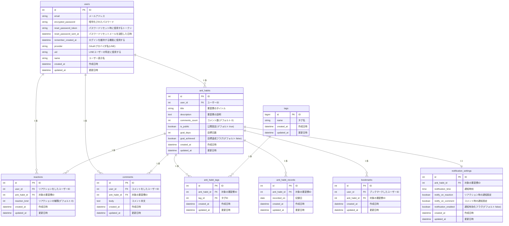

## 画面遷移図
Figma：https://www.figma.com/design/5EIKs4ZNjtIcXsfwtx5yOk/test-Project?node-id=74-2&t=NkVOgwoO1YP3TxIm-1
