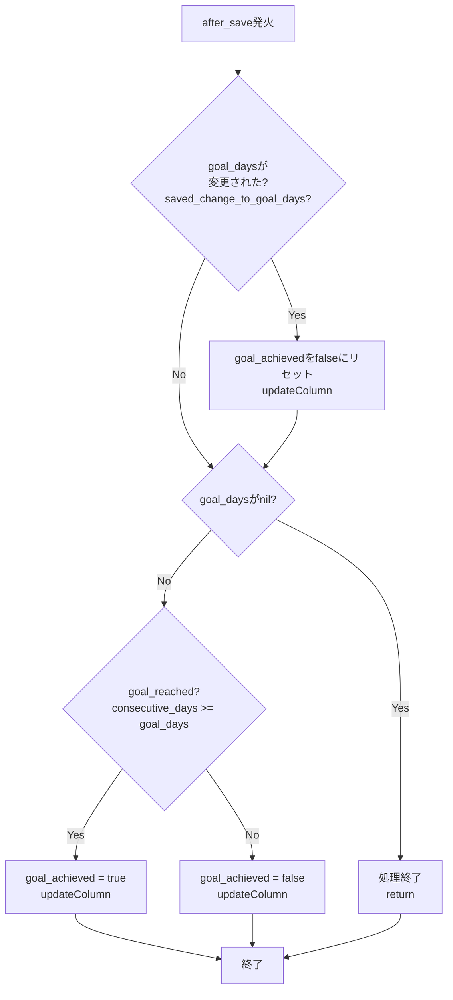

# AntiHabit::checkAndUpdateGoalAchievement

`app/Models/AntiHabit.php` L222-237

`saved` イベント（および記録の作成・削除時）に呼ばれる。目標日数の変更検知と達成フラグの更新を行う。

```mermaid
flowchart TD
    A[after_save発火] --> B{goal_daysが<br>変更された?<br>saved_change_to_goal_days?}

    B -- Yes --> C[goal_achievedをfalseにリセット<br>updateColumn]
    B -- No --> D{goal_daysがnil?}

    C --> D

    D -- Yes --> E[処理終了<br>return]
    D -- No --> F{goal_reached?<br>consecutive_days >= goal_days}

    F -- Yes --> G[goal_achieved = true<br>updateColumn]
    F -- No --> H[goal_achieved = false<br>updateColumn]

    G --> I[終了]
    H --> I
    E --> I
```
