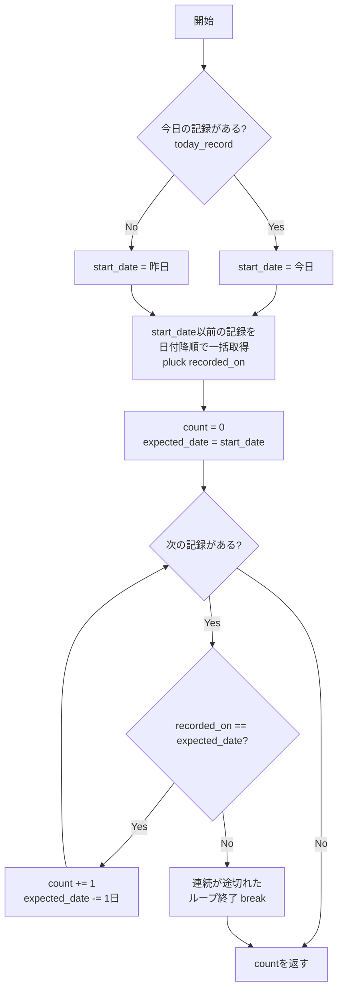

# AntiHabit::consecutiveDaysAchieved

`app/Models/AntiHabit.php` L189-210

今日または昨日を起点に、途切れずに記録された連続日数を計算する。

```mermaid
flowchart TD
    A[開始] --> B{今日の記録がある?<br>today_record}

    B -- Yes --> C[start_date = 今日]
    B -- No --> D[start_date = 昨日]

    C --> E[start_date以前の記録を<br>日付降順で一括取得<br>pluck recorded_on]
    D --> E

    E --> F[count = 0<br>expected_date = start_date]

    F --> G{次の記録がある?}
    G -- No --> K[countを返す]

    G -- Yes --> H{recorded_on == expected_date?}

    H -- Yes --> I[count += 1<br>expected_date -= 1日]
    I --> G

    H -- No --> J[連続が途切れた<br>ループ終了 break]
    J --> K
```
