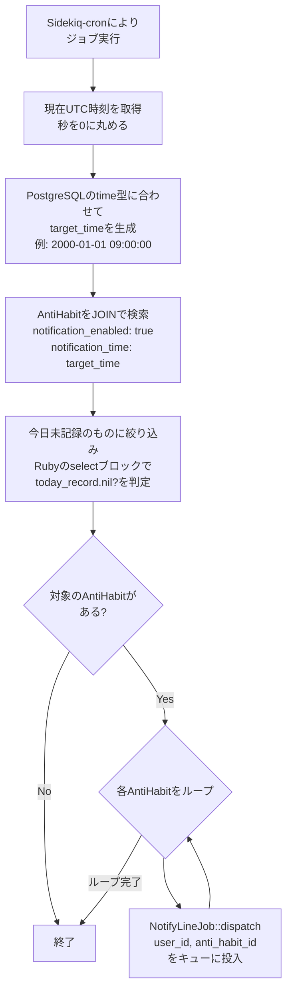

# NotifyDispatcherJob::handle

`app/Jobs/NotifyDispatcherJob.php` L19-41

定期実行ジョブ。現在時刻に通知設定が一致するAntiHabitを検索し、LINE通知ジョブをキューに投入する。

```mermaid
flowchart TD
    A[Sidekiq-cronにより<br>ジョブ実行] --> B[現在UTC時刻を取得<br>秒を0に丸める]

    B --> C["PostgreSQLのtime型に合わせて<br>target_timeを生成<br>例: 2000-01-01 09:00:00"]

    C --> D[AntiHabitをJOINで検索<br>notification_enabled: true<br>notification_time: target_time]

    D --> E["今日未記録のものに絞り込み<br>Rubyのselectブロックで<br>today_record.nil?を判定"]

    E --> F{対象のAntiHabitが<br>ある?}

    F -- No --> G[終了]
    F -- Yes --> H{各AntiHabitをループ}

    H --> I[NotifyLineJob::dispatch<br>user_id, anti_habit_id<br>をキューに投入]
    I --> H

    H -- ループ完了 --> G
```
