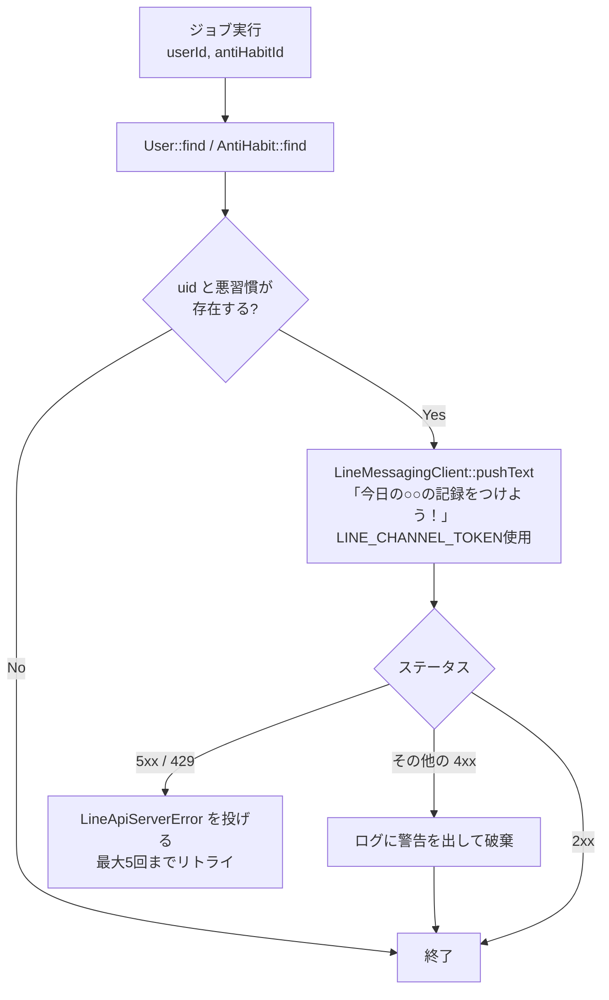

# NotifyLineJob::handle

`app/Jobs/NotifyLineJob.php` L31-54

非同期ジョブ。LINE Messaging API を使ってユーザーにプッシュ通知を送信する。

```mermaid
flowchart TD
    A[ジョブ実行<br>userId, antiHabitId] --> B[User::find / AntiHabit::find]

    B --> C{uid と悪習慣が<br>存在する?}
    C -- No --> Z[終了]

    C -- Yes --> D["LineMessagingClient::pushText<br>「今日の○○の記録をつけよう！」<br>LINE_CHANNEL_TOKEN使用"]

    D --> E{ステータス}
    E -- "5xx / 429" --> F[LineApiServerError を投げる<br>最大5回までリトライ]
    E -- "その他の 4xx" --> G[ログに警告を出して破棄]
    E -- "2xx" --> Z
    G --> Z
```
