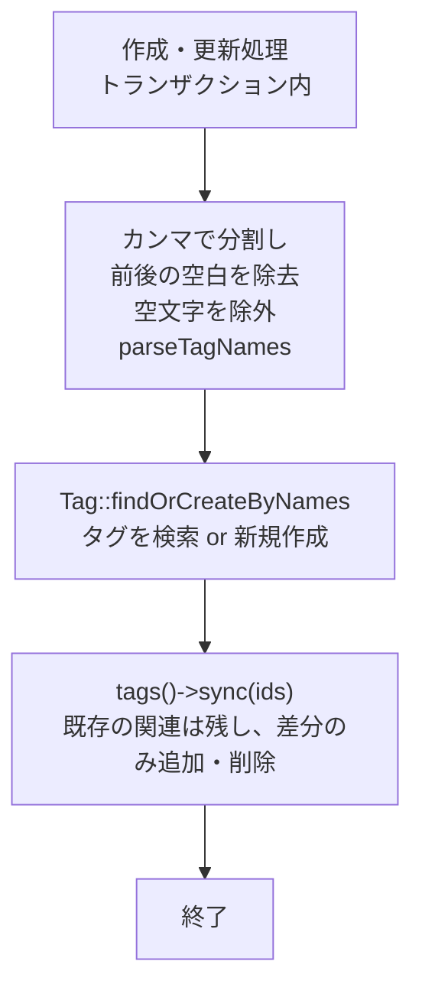

# AntiHabit::syncTagNames

`app/Models/AntiHabit.php` L285-291

悪習慣の作成・更新時にコントローラから呼ばれる。カンマ区切りのタグ名を処理し、タグの関連付けを同期する。
（Rails 版の `after_save :save_tags_without_validation` に相当）

```mermaid
flowchart TD
    A[作成・更新処理<br>トランザクション内] --> B[カンマで分割し<br>前後の空白を除去<br>空文字を除外<br>parseTagNames]

    B --> C[Tag::findOrCreateByNames<br>タグを検索 or 新規作成]

    C --> D["tags()->sync(ids)<br>既存の関連は残し、差分のみ追加・削除"]

    D --> E[終了]
```
